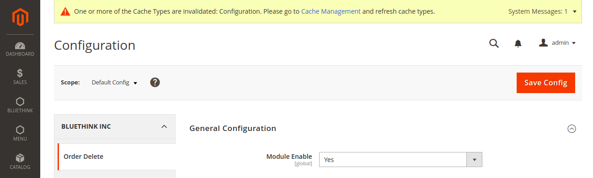
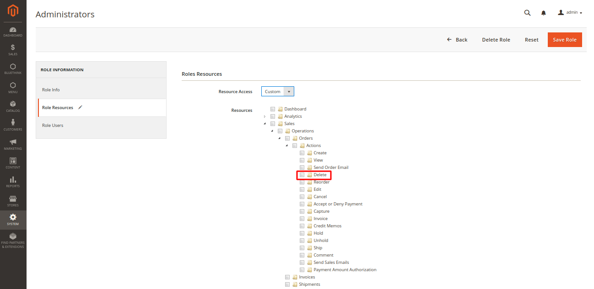

# Mage2 Module Bluethinkinc OrderDelete

    ``bluethinkinc/orderdelete``

-   [Main Functionalities](#markdown-header-main-functionalities)
-   [Installation](#markdown-header-installation)
-   [Configuration](#markdown-header-configuration)
-   [Specifications](#markdown-header-specifications)

## Main Functionalities

The purpose of Order Delete module is to delete order from admin panel. This module is supported with multi-website and can be managed from admin section by admin users.

## Installation

\* = in production please use the `--keep-generated` option

### Type 1: Zip file

-   Unzip the zip file in `app/code/Bluethinkinc`
-   Enable the module by running `php bin/magento module:enable Bluethinkinc_OrderDelete`
-   Apply database updates by running `php bin/magento setup:upgrade`\*
-   Flush the cache by running `php bin/magento cache:flush`

### Type 2: Composer

-   Make the module available in a composer repository for example:
    -   private repository `repo.magento.com`
    -   public repository `packagist.org`
    -   public github repository as vcs
-   Add the composer repository to the configuration by running `composer config repositories.repo.magento.com composer https://repo.magento.com/`
-   Install the module composer by running `composer require bluethinkinc/orderdelete`
-   enable the module by running `php bin/magento module:enable Bluethinkinc_OrderDelete`
-   apply database updates by running `php bin/magento setup:upgrade`\*
-   Flush the cache by running `php bin/magento cache:flush`

## Configuration

In Admin panel you need to enable this module under
** store > configuration > Bluethinkinc > OrderDelete > General Configuration **
There are few options to enable/disable Delete button for OrderDelete module.

## Specifications

On admin you can able to see OrderDelete button after complete setting from admin panel and also goto any order details page.

On admin you can able to see OrderDelete button for multiselect data in sales order page.

After delete order look like as below

After multi select delete order look like as below

## Special Feature

In Admin panel Administrators can provide the authority to the admin users who can access
this feature and who can't access.
** System > User Roles > Select Role > Roles Resources > Resources Access **

